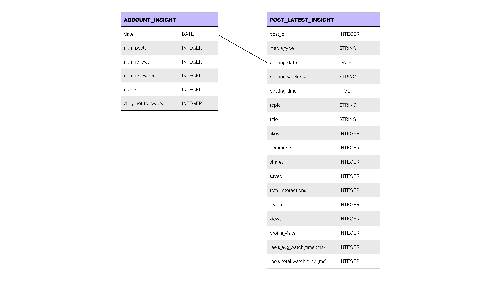

<!-- PROJECT SHIELDS -->
[![LinkedIn][linkedin-shield]][linkedin-url]

<!-- PROJECT TITLE -->
# Instagram Growth Analysis for Comedy Niche Account

<!-- TABLE OF CONTENTS -->
### Table of Contents
1. [Project Background](#1-project-background)
2. [Executive Summary (Updated: 15 Jun 2025)](#2-executive-summary-updated-15-jun-2025)
3. [Proposed Hypotheses](#3-proposed-hypotheses)
4. [Content Strategies (Mid-Jun to Mid-Sep 2025)](#4-content-strategies-mid-jun-to-mid-sep-2025)
5. [Caveats and Assumptions](#5-caveats-and-assumptions)

<!-- PROJECT BACKGROUND -->
## 1. Project Background

<h4>Objective</h4>
   

      Sought data-driven insights to optimise engagement and personal branding for a new comedy-focused Instagram account (@seethis_youfunny) targeting Sinophone (Chinese-speaking) comedy fans and comedians.
   

<h4>Project Workflow</h4>
   <ol>
      <li>
         Automated Data Collection (Python, Instagram API)
         <ul>
            <li>Daily account metrics (follower growth, post engagement) are extracted via cron-scheduled scripts.</li>
            <li>Scope: Starting at 18 followers in late May 2025.</li>
         </ul>
      </li>
      <li>
         Data Cleaning and Exploration (Python － Pandas, NumPy) <a href="https://github.com/khlleung/instagram-analysis/blob/main/python" target="_blank">[code]</a>
         <ul>
            <li>Addressed missing data via linear interpolation.</li>
            <li>Standardised timezones (HKT) and created derived fields (e.g., <code>daily_net_followers</code>).</li>
            <li>
               Entity Relationship Diagram of the cleaned dataset:
               

                  
               

            </li>
         </ul>
      </li>
      <li>
         Visualisation & Dashboard Building <a href="https://public.tableau.com/views/InstagramUserAnalyticsDashboard/FinalDashboard?:language=en-GB&publish=yes&:sid=&:redirect=auth&:display_count=n&:origin=viz_share_link" target="_blank">[dashboard]</a>
         <ul>
            <li>Tracked growth trends, content performance, and metric spikes (reach, engagement).</li>
            <li>Identified high-impact content types.</li>
         </ul>  
      </li> 
      <li>
         Content Strategy Formulation
         <ul>
            <li>Developed a 3-month data-driven content strategy (mid-Jun to Sep 2025) to optimise content creation.</li>
         </ul>  
      </li>
   </ol>

(<a href="#readme-top">back to top</a>)

<!-- EXECUTIVE SUMMARY -->
## 2. Executive Summary (Updated: 15 Jun 2025)

<h4>Account Growth (18 → 169 Followers)</h4>
<ul>
   <li>Follower spikes correlate directly with viral Reels, e.g., my 12th content drove +57 net followers.</li>
   <li>Reach surges mostly occurred on the day or a day after high-performing content.</li>
</ul>
                
<h4>Content Performance (16 Posts － 12 Carousels, 4 Reels)</h4>
   <ul>
      <li>Reels outperform carousel posts regarding reach and engagement (likes, shares, saves). 4 out of 5 top content being Reels, and only the monthly event calendar carousel post cracked the top 5.</li>
      <li>Low comment rates across all content types.</li>
   </ul>

[![Tableau Dashboard Screenshot][tableau-dashborad-screenshot]][tableau-dashboard-url]

(<a href="#readme-top">back to top</a>)

<!-- PROPOSED HYPOTHESES -->
## 3. Proposed Hypotheses
| Insight  | Proposed Hypotheses |
| ------------- | ------------- |
| Reach ↔ Follower correlation | <ul><li>Reach drives follows.</li><li>Follower growth incentivises further algorithmic distribution.</li></ul> |
| Weak performance of carousel posts | <ul><li>Unattractive covers.</li><li>Text-heavy slides.</li><li>Lack of comedic credibility.</li></ul> |
| Low comments | <ul><li>Weak CTAs.</li><li>Users scrolling away before seeing the engagement prompts (e.g., end-of-carousel CTAs).</li></ul> |

(<a href="#readme-top">back to top</a>)

<!-- CONTENT STRATEGIES -->
## 4. Content Strategies (Mid-Jun to Mid-Sep 2025)

<h4>Immediate Actions (Jun 2025)</h4>
<ul>
   <li>
      Revamp Carousel Post
      <ul>
         <li>Reduce text by 50%.</li>
         <li>Use visually compelling covers.</li>
      </ul>
   </li>
   <li>
      Build connections with my followers using a VTuber avatar
      <ul>
         <li>Build a stick figure VTuber model with GIMP and Live2D.</li>
         <li>Create debut Reels to launch my model.</li>
         <li>Include image stills of the avatar in my content.</li>
      </ul>
   </li>
   <li>
      Establish credibility in comedy by posting original jokes
      <ul>
         <li>Create a secondary account with the same branding as my main account, except it is about making funny memes.</li>
         <li>Feature my avatar as the main character of the memes.</li>
      </ul>
   </li>
</ul>

<h4>Long-Term Strategy (Jul to Sep 2025)</h4>
   <ul>
     <li>
       Content Tests
       <ul>
         <li>Reels: Talking-head videos answering comedy questions using the VTuber model, similar to Pikat’s and Rin Penrose’s YouTube Shorts styles.</li>
         <li>Carousel Posts: Informative content that incentivises saves and shares, such as comedy troupe spotlights and open mic guides.</li>
       </ul>
     </li>
   </ul>

(<a href="#readme-top">back to top</a>)

<!-- CAVEATS AND ASSUMPTIONS -->
## 5. Caveats and Assumptions 

<h4>Incomplete Data</h4>

Missing data from the launch period (28 April to 24 May 2025). Also, the Instagram API fails to collect separate data regarding each Instagram Story.

<h4>Varied Data Collection Time</h4>

   Crontab fails occasionally, so I sometimes run the Python code manually after the scheduled time.

(<a href="#readme-top">back to top</a>)

<!-- MARKDOWN LINKS & IMAGES -->
[linkedin-shield]: https://img.shields.io/badge/linkedin-%230077B5.svg?style=for-the-badge&logo=linkedin&logoColor=white
[linkedin-url]: https://linkedin.com/in/khlleung
[tableau-dashboard-url]: https://public.tableau.com/views/InstagramUserAnalyticsDashboard/FinalDashboard?:language=en-GB&publish=yes&:sid=&:redirect=auth&:display_count=n&:origin=viz_share_link
[tableau-dashborad-screenshot]: graphs/dashboard_20250615.png